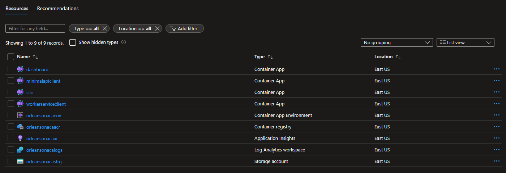

# Deploy an Orleans Cluster on Azure Container Apps

This repository contains an end-to-end sample and tutorial for getting a Microsoft Orleans cluster running on Azure Container Apps. Worker microservices rapidly transmit data to a back-end Orleans cluster for monitoring and storage, emulating thousands of physical devices in the field.

## What you'll do

Throughout this tutorial you'll complete the following tasks:

1. Use GitHub Actions, Bicep, and the Azure CLI to deploy a cloud-native .NET application to Azure Container Apps.
2. Monitor the app in real-time using the Orleans Dashboard.
3. Simulate load by increasing the number of Worker services in the Azure portal.
4. Scale the back end out.
5. Scale the simulation back to zero client load.
6. Scale the back end down to a minimal load.

## What you'll learn

This exercise will introduce you to a variety of concepts, with links to supporting documentation throughout the tutorial. 

* [Microsoft Orleans](https://docs.microsoft.com/dotnet/orleans)
* [Azure Container Apps](https://docs.microsoft.com/azure/container-apps/overview)
* [GitHub Actions](https://github.com/features/actions)
* [Azure Container Registry](https://docs.microsoft.com/azure/container-registry/)
* [Azure Bicep](https://docs.microsoft.com/azure/azure-resource-manager/bicep/overview?tabs=**bicep**)

By the end, you'll be introduced to the world of distributed systems using Azure's newest container PaaS - Azure Container Apps - and .NET's cloud-native primitive - [Orleans Grains](https://docs.microsoft.com/dotnet/orleans/grains/).

## Prerequisites

You'll need an Azure subscription and a very small set of tools and skills to get started:

1. An Azure subscription. Sign up [for free](https://azure.microsoft.com/free/).
2. A GitHub account, with access to GitHub Actions.
3. Either the [Azure CLI](https://docs.microsoft.com/cli/azure/install-azure-cli) installed locally, or, access to [GitHub Codespaces](https://github.com/features/codespaces), which would enable you to do develop in your browser.

## Setup

The first thing you'll do is to set up your own copy of this sample repository and configure it to talk to Azure. 

1. Fork this repository to your own GitHub organization.

2. Create an Azure Service Principal using the Azure CLI. 

```bash
az ad sp create-for-rbac --sdk-auth --role contributor --scopes /subscription/<your-subscription-id>
```

3. Copy the JSON written to the screen to your clipboard. 

```json
{
  "clientId": "",
  "clientSecret": "",
  "subscriptionId": "",
  "tenantId": "",
  "activeDirectoryEndpointUrl": "https://login.microsoftonline.com/",
  "resourceManagerEndpointUrl": "https://brazilus.management.azure.com",
  "activeDirectoryGraphResourceId": "https://graph.windows.net/",
  "sqlManagementEndpointUrl": "https://management.core.windows.net:8443/",
  "galleryEndpointUrl": "https://gallery.azure.com",
  "managementEndpointUrl": "https://management.core.windows.net"
}
```

4. Create a new GitHub secret in your fork of this repository named `AzureSPN`. Paste the JSON returned from the Azure CLI into this new secret. Once you've done this you'll see the secret in your fork of the repository.

   

> Note: Never save the JSON to disk, for it will enable anyone who obtains this JSON code to create or edit resources in your Azure subscription. 

## Provision the Azure resources

With your Azure account login stored as a secret in your fork of the repository, you can now provision new Azure resources. During this phase, you'll create these resources in your Azure subscription, simply by creating a small edit in a branch of the repository:

* An Azure Storage account, to be used for the Orleans Cluster's persistence and clustering capabilities. 
* An Azure Container Registry instance, which is used to store the container images you'll build using GitHub Actions' CI/CD features.
* A few Azure Container Apps, a scalable compute layer in which the code for the demo will run. 
* An Azure Log Analytics instance and an Azure Application Insights instance, which will collect telemetry and diagnostic information about your app.

You can either perform these steps locally, in a GitHub Codespace, or by simply creating a small edit to the `.github/workflows/provision.yml` file and saving it to a new `provision` branch in your fork of the repository.

5. Create a new local branch named `provision`. 

```bash
git checkout -b provision
```

6. Open the `.github/workflows/provision.yml` file and find this section:

```yaml
env:
  RESOURCE_GROUP_NAME: orleansoncontainerapps
  REGION: eastus
```

7. Change the `RESOURCE_GROUP_NAME` variable to be what you'd like your Azure resource group to be named. 

> Note: The `RESOURCE_GROUP_NAME` variable should be all lowercase letters and digits only.

```yaml
env:
  RESOURCE_GROUP_NAME: orleansonaca
  REGION: eastus
```

8. Commit the changes and push them back to GitHub, on the `provision` branch you just created. 

```bash
git add .
git commit -m 'provisioning'
git push origin provision
```

9. Browse to the `Actions` tab in your GitHub repository to see if the `provision` CI/CD process started.


10. When the `provision` step completes, you'll see a few new Azure resources in your subscription.




## Deploy code into the environment

Once the `provision` process completes, you can create a second branch in the repository named `deploy`, which you'll use to deploy code into the environment each time you're ready to update it. 

10. Create a local branch named `deploy`. Find the `deploy.yml` GitHub workflow file in the local repository, specifically this code which sets the resource group and Azure Container Registry variable names. 

```yaml
env:
  CONTAINER_APP_RESOURCE_GROUP_NAME: orleansoncontainerapps
  CONTAINER_REGISTRY_LOGIN_SERVER: orleansoncontainerapps.azurecr.io
```

11. Customize these values so they match the Azure resource names you just created.

```yaml
env:
  CONTAINER_APP_RESOURCE_GROUP_NAME: orleansonaca
  CONTAINER_REGISTRY_LOGIN_SERVER: orleansonacaacr.azurecr.io
```

Commit your changes and push them to the `deploy` branch.

```bash
git add .
git commit -m 'deploying'
git push origin deploy
```

Then browse to the `Actions` tab in your GitHub repository to see if the `deploy` CI/CD process started.


